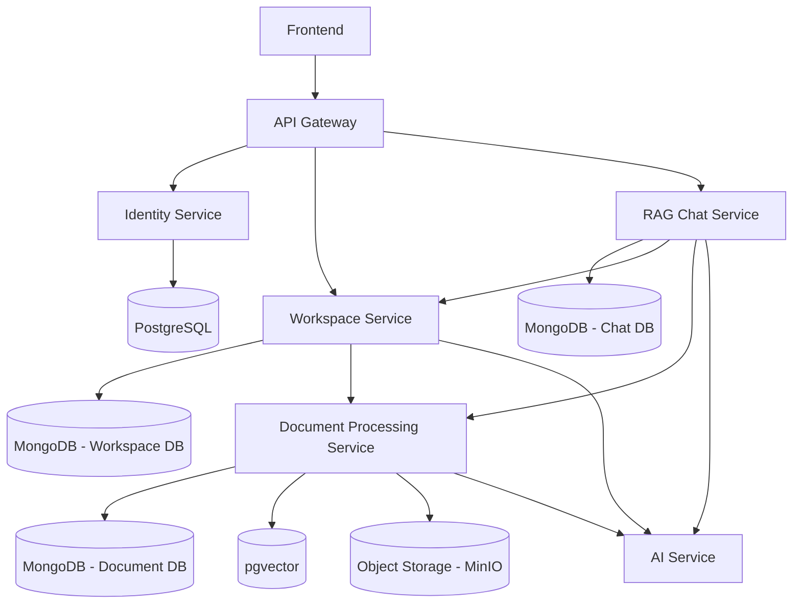

# Service & Data Architecture

## Detailed System Architecture Diagram

## Storage & Service Mapping

| Service | Primary Storage | Secondary / Special Storage | Purpose |
| :--- | :--- | :--- | :--- |
| **Identity Service** | PostgreSQL (`PG`) | - | Auth, User Accounts, Credentials, JWT & Roles |
| **Workspace Service** | MongoDB (`MW`) | - | Workspace management, Projects & User Memberships |
| **Document Processing Service** | MongoDB (`MD`) | pgvector (`Vec`), MinIO (`Store`) | Document metadata, Raw file storage & Vector embeddings |
| **RAG Chat Service** | MongoDB (`MC`) | - | Chat sessions, Message history & RAG context assembly |
| **AI Service** | Stateless / External APIs | - | Gemini 2.5 Flash, LlamaParser API & Embedding generation |
